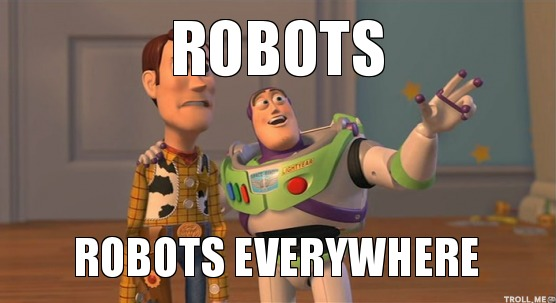
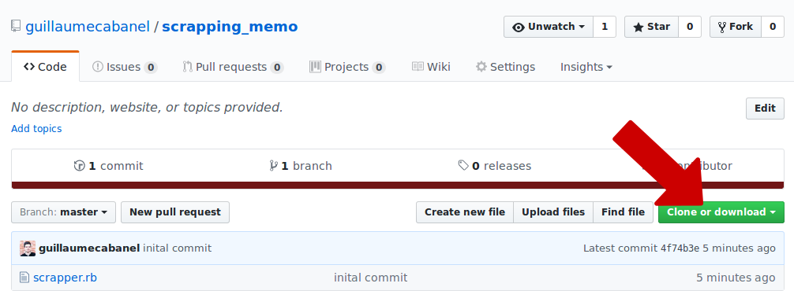

## Scrapping 101


vvv

### 👉 <span class="lowercase">https://dribbble.com/search?q=wagon</span>

---

## De quoi avons-nous besoin ?

- Ruby
- Nokogiri
- Un *bon* navigateur

---

<div class="icon-left"><i class="fa fa-file-code-o"></i></div>
```ruby
require 'open-uri'
require 'nokogiri'

html_file = open("https://dribbble.com/search?q=wagon")
puts html_file
```
<div class="icon-left"><i class="fa fa-terminal"></i></div>
```bash
#<File:0x0055a1f9008ac0>
```
<!-- .element: class="fragment" data-fragment-index="2" -->

---

<div class="icon-left"><i class="fa fa-file-code-o"></i></div>
```ruby
html_file = open("https://dribbble.com/search?q=wagon")
html_document = Nokogiri::HTML(html_file)

puts html_document
```
<div class="icon-left"><i class="fa fa-terminal"></i></div>
```html
<!DOCTYPE html>
<html lang="en">
<head>
<meta http-equiv="Content-Type" content="text/html; charset=utf-8">
  <title>
      Dribbble - Show and tell for designers
  </title>
  <meta charset="utf-8">
<script type="text/javascript">
...
```
<!-- .element: class="fragment" data-fragment-index="2" -->

---

### Objet Nokogiri

<div class="icon-left"><i class="fa fa-file-code-o"></i></div>
```ruby
puts html_document.title
```

<div class="icon-left"><i class="fa fa-terminal"></i></div>
```markdown
Dribbble - Show and tell for designers
```
<!-- .element: class="fragment" data-fragment-index="2" -->

---


---

### Texte

<div class="icon-left"><i class="fa fa-file-code-o"></i></div>
```ruby
dribbbles = html_document.css('li.group')

dribbbles.each do |dribbble|
  puts dribbble.css(
   '.dribbble .dribbble-shot .dribbble-img a.dribbble-over strong'
  ).text
end
```

<div class="icon-left"><i class="fa fa-terminal"></i></div>
```markdown
Flight of the Conchords (New Zealand Tour)
Road Trip
Get Lost
Kinkaider Brewing Co. - Moscow Mule
BM Branding
...
```
<!-- .element: class="fragment" data-fragment-index="2" -->

---

### Liens

<div class="icon-left"><i class="fa fa-file-code-o"></i></div>
```ruby
dribbbles = html_document.css('li.group')

dribbbles.each do |dribbble|
  puts dribbble.css(
    '.dribbble .dribbble-shot .dribbble-img   a.dribbble-over'
  ).attr('href')
end
```

<div class="icon-left"><i class="fa fa-terminal"></i></div>
```markdown
/shots/843497-Flight-of-the-Conchords-New-Zealand-Tour
/shots/2927629-Road-Trip
/shots/2657798-Get-Lost
/shots/3559258-Kinkaider-Brewing-Co-Moscow-Mule
/shots/1289463-BM-Branding
...
```
<!-- .element: class="fragment" data-fragment-index="2" -->

---

### Images

<div class="icon-left"><i class="fa fa-file-code-o"></i></div>
```ruby
dribbbles = html_document.css('li.group')

dribbbles.each do |dribbble|
  puts dribbble.css(
    '.dribbble .dribbble-shot div.dribbble-img a.dribbble-link picture img'
  ).attr('src')
end
```

<div class="icon-left"><i class="fa fa-terminal"></i></div>
```markdown
https://cdn.dribbble.com/users/31348/screenshots/843497/fotc_newzealand_dribbble_teaser.jpg
https://cdn.dribbble.com/users/548267/screenshots/2927629/road_trip-dribbble_teaser.jpg
https://cdn.dribbble.com/users/548267/screenshots/2657798/wagon_v1_dribbble_teaser.jpg
https://cdn.dribbble.com/users/548267/screenshots/3559258/kinkaider-moscow-mule-_teaser.jpg
...
```
<!-- .element: class="fragment" data-fragment-index="2" -->

---

### Résumé

<div class="icon-left"><i class="fa fa-file-code-o"></i></div>
```ruby
  element = html_document.css(css_path)

  # text
  element.text

  # link
  element.attr('href')

  # image url
  element.attr('src')
```

---

### Mémo sur Github 🎉

👉 https://github.com/guillaumecabanel/scrapping_memo


